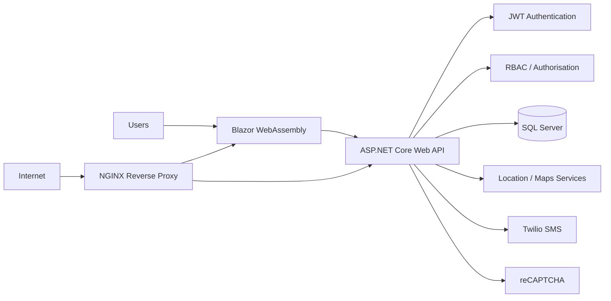
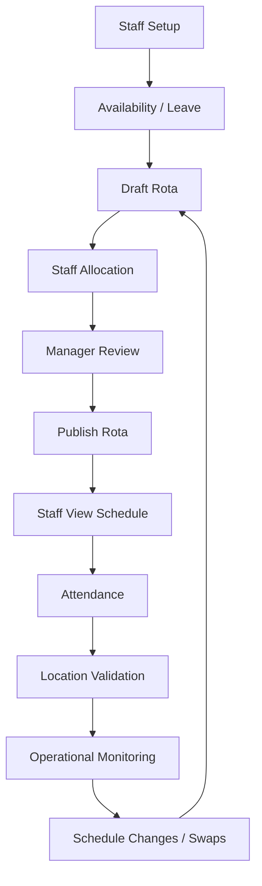

# RotaMan — Care Home Workforce & Rota Management Platform

> A secure, location-aware workforce management platform designed to simplify rota planning, staff scheduling, attendance and day-to-day workforce operations for care organisations.

**Portfolio / Case Study Repository — No production source code is included.**

- **Live Demo:** https://rincsdemo.co.uk/login
- **Company:** https://rincsit.com/

## Executive Summary

RotaMan is a web-based workforce and rota management platform designed around the operational needs of care organisations.

It brings rota planning, staff allocation, leave, shift swaps, attendance, location-aware controls, role-based access and notifications into a central workflow.

The goal is simple: reduce repetitive administration, improve operational visibility, provide appropriate access to different staff roles, and create a foundation for further automation and analytics.

## Business Problem

Care organisations often coordinate:

- Multiple employees across different shifts
- Staff availability and leave
- Permanent, bank and agency workers
- Shift changes and swaps
- Attendance and operational checks
- Location-aware attendance requirements
- Staff communication
- Managerial oversight

When these activities are handled through disconnected spreadsheets, messages and manual processes, administrative effort can increase and information can become fragmented.

## Solution

RotaMan centralises these workflows into one application:

**Staff & Availability → Leave → Draft Rota → Staff Allocation → Review → Publish → Attendance → Location Validation → Monitoring**

This gives managers a structured workflow while giving caregivers access to the information and actions relevant to their role.

## Key Capabilities

### Rota Management

- Draft rota creation
- Calendar-based scheduling
- Shift creation and assignment
- Morning / Day / Night shift planning
- Published schedules
- Shift changes
- Shift swaps
- Leave-aware planning
- Internal and external/agency workforce allocation

### Role-Based Granular Access Control

RotaMan uses role-based access control rather than treating every authenticated user the same.

| Role | Typical responsibilities |
|---|---|
| **Admin** | Organisation administration, staff management, rota management, system configuration, attendance and access oversight |
| **Schedule Manager** | Staff management, rota planning, allocation, leave, swaps and attendance workflows |
| **Caregiver** | View assigned rota, request leave, participate in shift swaps and record attendance |

The access model is designed around operational responsibility and least-practical-access principles.

### Location-Aware Attendance

Location verification can be used as an additional operational condition around attendance.

Typical flow:

```text
Staff Login
    ↓
Authentication
    ↓
User / Role Validation
    ↓
Location Verification
    ↓
Within Permitted Area?
   ↙        ↘
 YES        NO
 ↓           ↓
Continue     Restrict / Flag
 ↓
Attendance / Shift Operation
```

This is designed for operational verification rather than continuous location surveillance.

### Leave & Shift Swaps

Leave information is incorporated into rota planning so managers can see staffing constraints before publishing schedules.

Shift changes can follow a structured workflow:

**Request → Review → Approval → Rota Update → Staff Visibility**

### Attendance & Operational Monitoring

RotaMan can support:

- Shift-based attendance
- Punch in/out
- Location-aware attendance controls
- Attendance records
- Break-overrun monitoring
- Outside-permitted-area checks
- Operational exception visibility

### Notifications

Workflow notifications can help communicate important changes to staff.

The platform includes integration with **Twilio SMS**, with an architecture that can be extended to additional communication channels.

### External / Agency Workforce

The platform can accommodate external workforce categories such as Agent/Bank staff and external companies, supporting organisations that combine permanent and flexible staffing.

## Business Value

RotaMan is designed to reduce repetitive administrative work around:

- Manual rota preparation
- Availability checking
- Leave cross-checking
- Staff allocation
- Shift change communication
- Shift swap coordination
- Attendance checking
- Location verification
- Spreadsheet maintenance
- Repeated staff communication

### Illustrative Time-Saving Model

Actual time savings depend on organisation size, staffing model and existing processes.

For example, if a care organisation spends **10 hours per week** preparing and maintaining rotas manually, and a digital workflow reduces that administrative effort by **50%**, the illustrative saving would be:

**5 hours/week × 52 weeks = 260 hours/year**

This is an illustrative business-value model, **not a measured RotaMan performance claim**.

## Technology Stack

| Layer | Technology |
|---|---|
| Frontend | Blazor WebAssembly, C# |
| UI / Scheduling | FullCalendar |
| Backend | ASP.NET Core Web API, .NET 6, C# |
| Data Access | Dapper |
| Database | Microsoft SQL Server |
| Authentication | JWT |
| Authorisation | Role-Based Access Control |
| API Protection | API-key middleware |
| Location | Google Maps / location services |
| Notifications | Twilio SMS |
| Bot Protection | Google reCAPTCHA |
| Web Server | NGINX |
| Hosting | Linux / Ubuntu VPS or cloud infrastructure |
| Transport Security | HTTPS / TLS |
| Version Control | GitHub |

## High-Level Architecture



## Core User Journey

1. Staff member signs in.
2. The platform validates identity.
3. Role and permissions are evaluated.
4. The user accesses the functions available to their role.
5. The caregiver views assigned shifts.
6. An attendance action can trigger location validation.
7. The attendance operation is recorded.
8. Managers can review operational information.

## Security Model

Security is considered at multiple layers:

- Authentication using JWT
- Role-based authorisation
- Granular operational access
- Protected API endpoints
- API middleware controls
- HTTPS/TLS
- Location-aware operational checks
- Separation of public and protected functionality
- No production credentials or personal data in this portfolio repository

Authentication answers:

> **Who are you?**

Authorisation answers:

> **What are you allowed to do?**

RotaMan uses both concepts to establish appropriate access boundaries.

## Example Operational Workflow



## What Makes RotaMan a Useful Portfolio Project

The platform demonstrates RINCS capability across both business analysis and engineering:

- Understanding a real operational workflow
- Designing a business-critical web application
- Secure authentication and authorisation
- Granular RBAC
- Location-aware business rules
- Calendar-based workforce scheduling
- External service integration
- API-first application architecture
- Database-backed business workflows
- Linux / NGINX deployment
- Extensible architecture for future automation and analytics

## Intended Users

RotaMan is applicable to workflows such as:

- Care homes
- Domiciliary care organisations
- Nursing-at-home services
- Multi-shift organisations
- Organisations using permanent and agency workers
- Other workforce-heavy businesses requiring structured scheduling

## Product Demonstration

Explore the demonstration environment:

**https://rincsdemo.co.uk/login**

Recommended areas to demonstrate:

- Authentication
- Role-based access
- Dashboard
- Staff management
- Rota calendar
- Shift allocation
- Leave management
- Shift swaps
- Attendance
- Location-aware workflows
- Notifications

Demo credentials are intentionally not stored in this repository.

## Repository Scope

This repository is a **portfolio and case-study repository**.

It intentionally does **not** contain:

- Production source code
- Passwords
- API keys
- Secrets
- Database backups
- Production configuration
- Private server addresses
- Patient information
- Employee personal information
- Client confidential information

## Future Roadmap

Potential extensions include:

- Workforce analytics
- Advanced operational reporting
- Payroll / timesheet integrations
- HR integrations
- Mobile experience
- Multi-site management
- Expanded compliance workflows
- AI-assisted rota planning
- Availability-aware rota suggestions
- Demand forecasting
- Additional third-party integrations

## About RINCS IT Services

RINCS IT Services delivers technology solutions across software development, web applications, cloud, DevOps, IT support, networking and in-house software solutions.

RotaMan demonstrates the company's ability to take a business workflow and turn it into a secure, structured and extensible digital platform.

## Portfolio Positioning

For an agency profile, RotaMan demonstrates experience in:

**Business Analysis → Solution Architecture → Software Development → Security → Integration → Deployment → Operational Workflow Improvement**

## License

This repository is intended for portfolio and demonstration purposes. Product names, documentation and visual assets remain the property of their respective owners.
