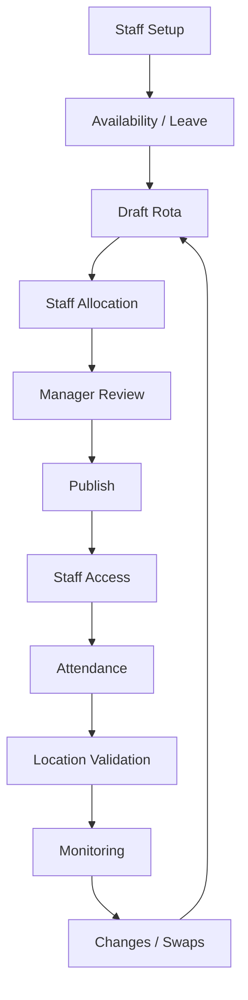

# Operational Workflow

## Typical Process

### 1. Staff Setup
Managers establish the workforce and appropriate roles.

### 2. Availability and Leave
Availability and approved leave are considered before assigning shifts.

### 3. Draft Rota
Managers build the rota using the scheduling interface.

### 4. Allocation
Staff are assigned to appropriate shifts.

### 5. Review
Managers check coverage and conflicts.

### 6. Publish
The rota becomes available to relevant staff.

### 7. Attendance
Staff perform attendance actions against assigned work.

### 8. Location Validation
Where configured, location is evaluated as an operational condition.

### 9. Monitoring
Managers can review attendance and operational exceptions.

### 10. Changes
Approved changes and swaps feed back into the rota workflow.
